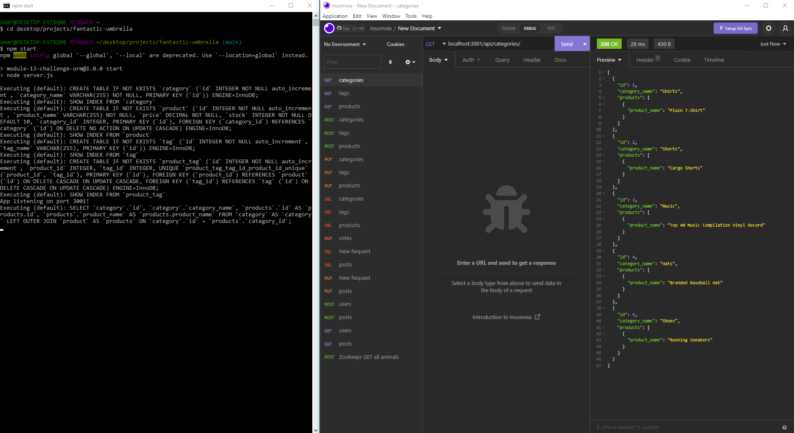

# Nickless Ecommercialize


## Description

This application will enable the front-end user to make a number of requests to the server, from retrieving all data related to the business products, categories and tags, either all at once or one at a time, but also the capability of updating these items and deleting them. Proper validations has been added to ensure proper data is stored in our databases.

The application follows RESTful API design for ease of code maintenance.

## Installation

In order to use this application, make sure to sure 'npm install' to obtain the appropriate npm modules that allow for the execution of the application. Sample file ```.env.EXAMPLE``` has been provided to set the environment variable to access mySQL. In order to get your application started, 

1) Rename the file to ```.env```
2) Open the file
3) Enter your  credentials for mySQL (DB_USER = 'your_user', DB_PW = 'your_password')

Please also make sure to read this entire README.md file for all additional information.

## Usage

Before the server can be started for the first time, ensure that the databases and tables have been created and data has been seeded to them. To do this, log into your mySQL from the base folder for your project, then run the following code: ``` source db/schema.sql ```

This should create the database. After you confirm it's been created successfully, quit mySQL. Then to create the tables and seed data, run the following script: ``` npm run seed ```. Confirm that not error occur.

Finally, start the server by running the script ``` npm start ```. You should now be connected to at localhost:3001.



A quick demo was recorded and can be found on the link below:

Demo link: https://drive.google.com/file/d/1xSlw8QUp8oRL_EF_ryFfZF9RFFAFKz0r/view

## Contribute

To contribute to this project, please fork it from the GitHub repository and when the pull request is sent, our team will work on merging the changes as needed/appropriate.

GitHub Repository Link: https://github.com/nickless192/nickless-ecommercialize

## Testing

Testing is currently not set up for this application.

## License

This project is covered under the MIT license agreement.

## Questions

Find my GitHub profile at https://github.com/nickless192 or email me at nickless@nickless.com.

## Contributors

Made with ❤️ by Nickless192 (Omar Rodriguez)